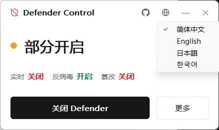

<p align="center">
  
</p>

<h1 align="center">Defender Control</h1>

<p align="center">
  A tiny native Windows tool to turn Windows Defender off and back on — one click, no fuss.<br/>
  一个原生 Windows 小工具，一键关闭 / 开启 Windows Defender。
</p>

<p align="center">
  
</p>

---

> [!WARNING]
> This tool **disables Windows Defender and real-time protection**, which lowers your system's security. Use it only on machines you own (a dev/test box, or to stop false‑positive deletions), and understand the risks. It backs up your current configuration before disabling and can restore it, but you are responsible for how you use it.

## Features

- **One‑click toggle** — disable or enable Defender (real‑time protection, antivirus, tamper protection, services and drivers) from a single button that adapts to the current state.
- **Backup & restore** — exports your current Defender registry before disabling and imports it again on enable; falls back to sane defaults if no backup exists.
- **TrustedInstaller‑level** — elevates to TI to reliably modify protected keys and services.
- **Watch mode** *(optional)* — a logon task that re‑suppresses Defender the moment Windows tries to turn it back on (event‑driven via `RegNotifyChangeKeyValue`, near‑zero CPU).
- **Live status** — overall state with a colored dot, plus real‑time / antivirus / tamper indicators and a per‑service detail panel.
- **Native & tiny** — pure Win32 + hand‑drawn GDI in Rust, ~300 KB, borderless DWM window, no WebView, no runtime dependencies.
- **4 languages** — auto‑detected and switchable (简体中文 / English / 日本語 / 한국어); your choice is remembered.

## Build

Requirements: **Rust (stable, MSVC toolchain)** on Windows 10/11.

```sh
cd app
cargo build --release
```

Output: `app/target/release/defender-control.exe` — run it as Administrator (the manifest requests elevation).

## Usage

- Launch the exe; it requests admin rights via UAC.
- Click **Disable Defender** / **Enable Defender** (the primary button reflects the current state).
- **More ⋯** — refresh status, view per‑service detail, install/remove the watch task.
- **Globe** — switch language. **GitHub** — open this repository.

## How it works

Disabling combines several established techniques, applied under a TrustedInstaller token: Defender policy registry keys, service & driver `Start` types, removing the `WdFilter` altitude value, stripping service PPL flags, `Set-MpPreference` (PowerShell), and an IFEO block on `mpcmdrun.exe`. A System Restore point is created first, and the touched registry is exported for restore. Enabling reverses all of it.

## Tech

Rust · [`windows`](https://crates.io/crates/windows) crate (Win32) · custom GDI rendering · DWM rounded borderless window. Title‑bar logos are rasterized from SVG ([simple‑icons](https://simpleicons.org), [lucide](https://lucide.dev)) into alpha masks and alpha‑blended at runtime.

## Disclaimer

Provided for educational use and authorized administration of **your own** systems. Re‑enabling is supported and a restore point is created, but everything here is **use at your own risk** — the author is not responsible for misuse or damage.

---

## 中文说明

一个原生 Win32 + GDI 的 Rust 小工具，用来一键关闭 / 开启 Windows Defender。

- **一键开关**：实时保护、反病毒、篡改防护、服务与驱动一起切换；主按钮按当前状态自动变「关闭 / 开启」。
- **备份与恢复**：关闭前导出当前 Defender 注册表，开启时还原；无备份则回落到默认值。
- **TrustedInstaller 提权**：以 TI 令牌修改受保护的键和服务。
- **防恢复监视**（可选）：登录任务，用 `RegNotifyChangeKeyValue` 事件驱动，一旦系统试图重新开启就立即压制，几乎零 CPU。
- **实时状态**：整体状态 + 实时 / 反病毒 / 篡改指示 + 服务详情面板。
- **小而美**：约 300 KB，无边框圆角窗口，无 WebView、无运行时依赖。
- **四语言**：自动检测、可切换（中 / EN / 日 / 한），记住选择。

> ⚠️ 本工具会关闭 Windows Defender，降低系统安全性。请仅在你自己的、了解风险的机器上使用。
