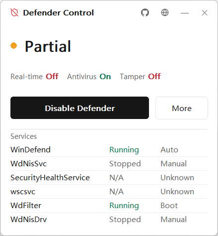
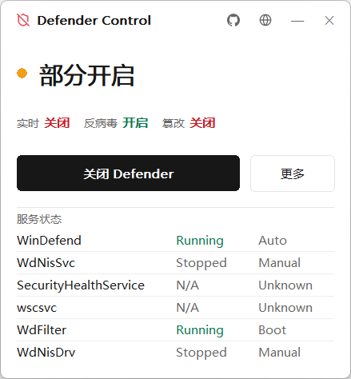
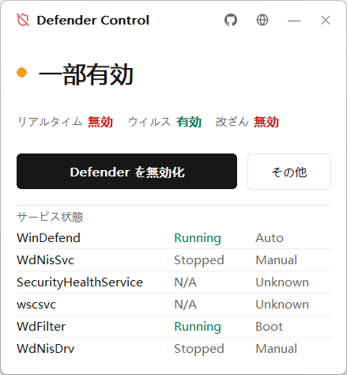
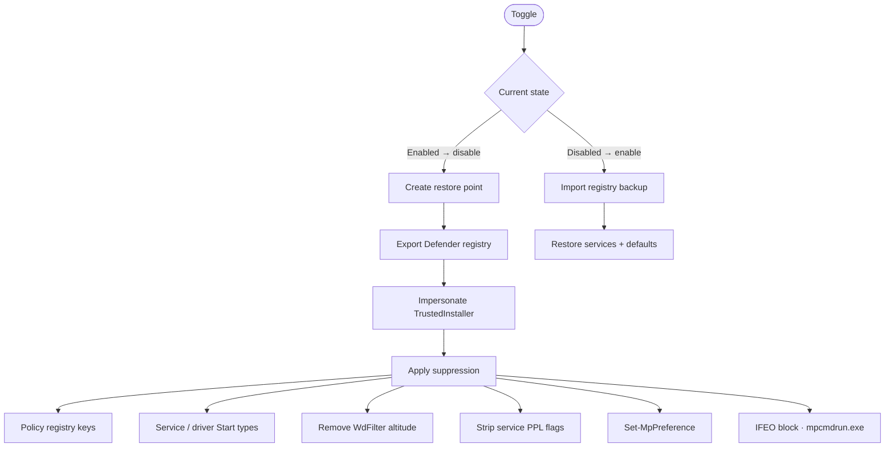
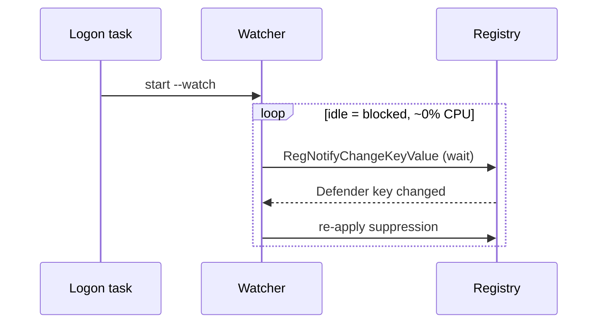

<div align="center">


<h1>Defender Control</h1>

<p><b>One‑click toggle for Windows Defender — native, tiny, reversible.</b></p>

<p>
  
  
  
  
  
  
</p>

<p>
  <a href="#english">English</a> ·
  <a href="#中文">简体中文</a> ·
  <a href="#日本語">日本語</a> ·
  <a href="#한국어">한국어</a>
</p>

<table>
  <tr>
    <td align="center"><br/><sub>English</sub></td>
    <td align="center"><br/><sub>简体中文</sub></td>
  </tr>
  <tr>
    <td align="center"><br/><sub>日本語</sub></td>
    <td align="center"><br/><sub>한국어</sub></td>
  </tr>
</table>

</div>

> [!WARNING]
> Disabling Defender lowers your system's security. Use it only on machines you own. A restore point and registry backup are created, but **use at your own risk.**
>
> 关闭 Defender 会降低系统安全性，仅在自有设备上使用，风险自负。 · Defender を無効化するとセキュリティが低下します。自己責任で。 · Defender 비활성화는 보안을 약화시킵니다. 본인 책임 하에 사용하세요.

<br/>

## Repository layout

This repo holds both the application and its website:

- **[`app/`](app/)** — the Windows application: Rust, native Win32 + GDI, no runtime dependencies.
- **[`landing/`](landing/)** — the marketing site at **[defender-control.errooe.com](https://defender-control.errooe.com)**: an Astro static site, deployed on Vercel (root directory `landing/`).

<br/>

## Architecture

Every state change runs under an impersonated **TrustedInstaller** token so that PPL‑protected keys and services can be written. The disable path is fully recorded (restore point + registry export) and the enable path replays it in reverse.



When **watch mode** is installed, a logon task blocks on the Defender key and re‑applies suppression the instant Windows touches it — event‑driven, so it consumes effectively no CPU while idle.



<br/>

---

<a name="english"></a>

## English

A native Win32 + GDI tool (Rust) that turns Windows Defender off and back on from a single state‑aware button.

**Features** — one‑click toggle (real‑time, antivirus, tamper, services, drivers) · registry backup & restore with sane‑default fallback · TrustedInstaller‑level writes · optional watch mode · live overall/real‑time/antivirus/tamper status with a per‑service panel · 4 languages (auto‑detected, remembered).

**Technical principles**

- **Pure Win32** — hand‑rolled `wndproc`, owner‑drawn GDI, DWM rounded borderless window, DPI‑aware. No WebView, no runtime dependencies.
- **TI escalation** — impersonates a TrustedInstaller token to modify protected keys and PPL services.
- **Suppression surface** — policy keys, service/driver `Start` types, `WdFilter` altitude removal, PPL‑flag stripping, `Set-MpPreference`, and an IFEO block on `mpcmdrun.exe`.
- **Reversible** — System Restore point + registry export on disable; full reverse on enable.
- **Watch mode** — event‑driven `RegNotifyChangeKeyValue`, near‑zero idle CPU.

**Build & run**

```sh
cd app && cargo build --release
```

Output `app/target/release/defender-control.exe` — runs elevated (UAC) via its manifest.

<br/>

---

<a name="中文"></a>

## 中文

原生 Win32 + GDI 的 Rust 工具，用一个随状态变化的按钮一键关闭 / 开启 Windows Defender。

**功能** — 一键开关（实时保护、反病毒、篡改防护、服务与驱动）· 注册表备份与恢复，无备份时回落默认值 · TrustedInstaller 级写入 · 可选防恢复监视 · 整体 / 实时 / 反病毒 / 篡改状态与服务详情面板 · 四语言（自动检测并记忆）。

**技术原理**

- **纯 Win32** — 手写 `wndproc`、GDI 自绘、DWM 无边框圆角窗口、DPI 自适应。无 WebView、无运行时依赖。
- **TI 提权** — 模拟 TrustedInstaller 令牌以修改受保护键与 PPL 服务。
- **压制面** — 策略键、服务/驱动 `Start` 类型、移除 `WdFilter` altitude、剥离 PPL 标志、`Set-MpPreference`、对 `mpcmdrun.exe` 的 IFEO 拦截。
- **可逆** — 关闭前创建系统还原点并导出注册表；开启时完整逆向。
- **监视模式** — 基于 `RegNotifyChangeKeyValue` 事件驱动，空闲几乎零 CPU。

**构建与运行**

```sh
cd app && cargo build --release
```

产物 `app/target/release/defender-control.exe`，清单已请求 UAC 提权运行。

<br/>

---

<a name="日本語"></a>

## 日本語

状態に応じて変化する単一ボタンで Windows Defender を一発で無効化 / 有効化する、ネイティブ Win32 + GDI（Rust）製ツール。

**機能** — ワンクリック切替（リアルタイム / アンチウイルス / 改ざん防止 / サービス / ドライバー）· レジストリのバックアップと復元（無い場合は既定値へフォールバック）· TrustedInstaller 権限での書き込み · 任意の監視モード · 全体 / リアルタイム / アンチウイルス / 改ざんの状態とサービス詳細パネル · 4 言語（自動検出・記憶）。

**技術的な仕組み**

- **純粋な Win32** — 手書き `wndproc`、GDI 自前描画、DWM の角丸ボーダーレスウィンドウ、DPI 対応。WebView もランタイム依存もなし。
- **TI 昇格** — TrustedInstaller トークンを偽装し、保護されたキーや PPL サービスを変更。
- **抑制ポイント** — ポリシーキー、サービス/ドライバーの `Start` 種別、`WdFilter` の altitude 削除、PPL フラグ除去、`Set-MpPreference`、`mpcmdrun.exe` への IFEO ブロック。
- **可逆** — 無効化時にシステムの復元ポイントとレジストリのエクスポート、有効化時に完全に逆適用。
- **監視モード** — `RegNotifyChangeKeyValue` によるイベント駆動で、待機中の CPU はほぼゼロ。

**ビルドと実行**

```sh
cd app && cargo build --release
```

成果物 `app/target/release/defender-control.exe` — マニフェストにより UAC 昇格で起動。

<br/>

---

<a name="한국어"></a>

## 한국어

상태에 따라 바뀌는 단일 버튼으로 Windows Defender 를 한 번에 끄고 켜는 네이티브 Win32 + GDI(Rust) 도구.

**기능** — 원클릭 전환(실시간 / 백신 / 변조 방지 / 서비스 / 드라이버) · 레지스트리 백업 및 복원, 백업이 없으면 기본값으로 대체 · TrustedInstaller 수준 쓰기 · 선택적 감시 모드 · 전체 / 실시간 / 백신 / 변조 상태와 서비스 세부 패널 · 4 개 언어(자동 감지 및 기억).

**기술 원리**

- **순수 Win32** — 직접 작성한 `wndproc`, GDI 직접 렌더링, DWM 둥근 모서리 테두리 없는 창, DPI 대응. WebView 없음, 런타임 의존성 없음.
- **TI 권한 상승** — TrustedInstaller 토큰을 가장해 보호된 키와 PPL 서비스를 수정.
- **억제 지점** — 정책 키, 서비스/드라이버 `Start` 유형, `WdFilter` altitude 제거, PPL 플래그 제거, `Set-MpPreference`, `mpcmdrun.exe` 에 대한 IFEO 차단.
- **가역적** — 비활성화 시 시스템 복원 지점 생성과 레지스트리 내보내기, 활성화 시 완전 역적용.
- **감시 모드** — `RegNotifyChangeKeyValue` 기반 이벤트 구동으로 유휴 시 CPU 거의 0.

**빌드 및 실행**

```sh
cd app && cargo build --release
```

산출물 `app/target/release/defender-control.exe` — 매니페스트를 통해 UAC 권한 상승으로 실행.

<br/>

<div align="center">
<sub>Licensed under the <a href="LICENSE">MIT License</a> · © 2026 sooua</sub><br/>
<sub>Rust · pure Win32 · no Electron, no WebView</sub>
</div>
